# Text From EZ Access Airport Kiosk Help Screens
## Airline Homepage

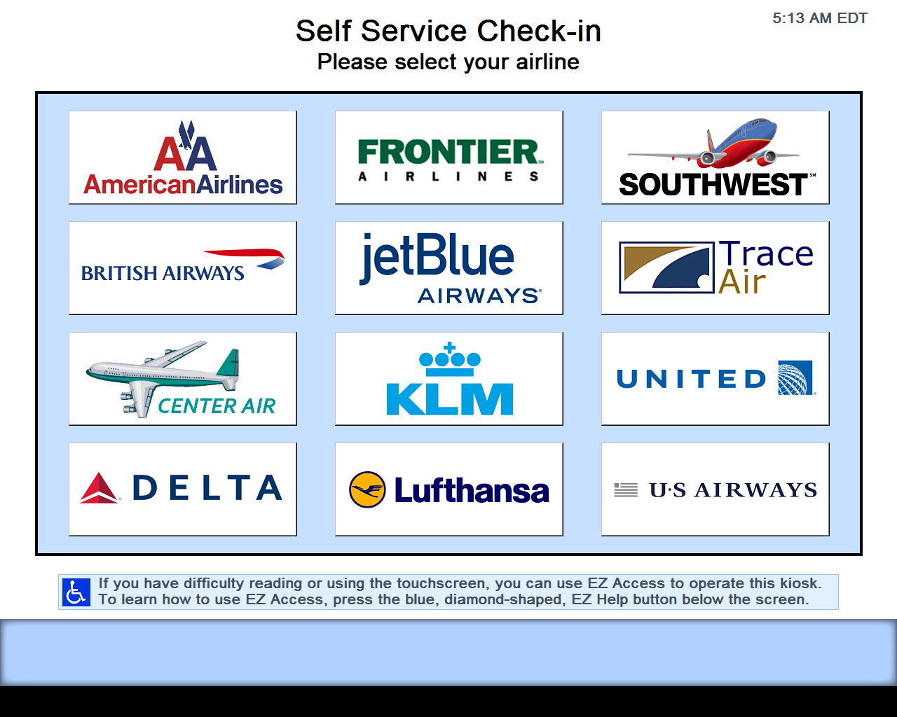

### Page 1
#### How to Use EZ Access

The EZ Access buttons on the keypad allow you to hear about the things you can do with this kiosk and to make choices. The kiosk will read to you through headphones when you use EZ Access. It will stop reading to you when you touch the rest of the screen. Screens on this kiosk may have many items on them, such as words, pictures, buttons, and checkboxes. You can use the EZ Up & Down buttons to move through these items. You will then use the round EZ Action button to make choices. To learn how to use the EZ Access buttons, let's start with the EZ Down arrow. The EZ Down arrow is a yellow button at the bottom of the EZ Access keypad. It is shaped like a triangle with the point down. Press it now to go to the next help screen.

___
To repeat this message, press the round EZ Action button.  
___
For more Help, press the EZ Down arrow button.  
To leave Help, press the EZ Help button.

### Page 2
#### How to find EZ Access buttons

There are six EZ Access buttons on the keypad below the
screen. You can use these buttons to operate this kiosk instead
of trying to read, reach, or use the touchscreen.
Two of the buttons are very important. They are the EZ Down &
EZ Action buttons. The EZ Down arrow is the yellow button at
the bottom of the keypad, which is shaped like a triangle with the
point down. The green EZ Action button is in the lower right
corner of the keypad and is a circle shape.
Press the EZ Down arrow button now to learn more about these
important buttons.

___
To repeat this message, press the round EZ Action button.  
___
For more Help, press the EZ Down arrow button.  
To leave Help, press the EZ Help button.

### Page 3
#### How to use EZ Access Buttons

You will usually start near the top of each screen. The EZ Down
arrow will move you down to the next item. If you do not want
that item, you can use the EZ Down arrow again. The EZ Down
arrow only moves and does not activate items or make any
changes.
The round EZ Action button is to the right of the EZ Down arrow.
It is used to choose items. After moving to the item you want,
you will then need to choose that item by pressing the EZ Action
button. Because you will start near the top of each screen, to
operate this kiosk you will usually arrow down several times and
then press EZ Action.
Press the EZ Down arrow button now to learn more about
moving on the screen.

___
To repeat this message, press the round EZ Action button.  
___
For more Help, press the EZ Down arrow button.  
To leave Help, press the EZ Help button.

### Page 4
#### How to move through screens

The EZ Down arrow moves down to the next item on the screen.
The EZ Up arrow is the opposite, and moves up to the previous
item on the screen.
The EZ Up arrow is just above the EZ Down arrow on the
keypad. If you went past something you wanted when using the
EZ Down arrow, you can move back up to it with the EZ Up arrow.
You can do everything you need to do on this kiosk using three
buttons: EZ Up, Down, & Action. To exit help and start using
this kiosk, press the blue, diamond-shaped EZ Help button. If
you want to learn about the other EZ Access buttons, press the
EZ Down arrow to get to the next help screen.

___
To repeat this message, press the round EZ Action button.  
___
For more Help, press the EZ Down arrow button.  
To leave Help, press the EZ Help button.

### Page 5
#### How to use other EZ Access Buttons

Above and to the left of the EZ Up arrow is the Back page
button. Above and to the right of the EZ Up arrow is the Next
page button.
The EZ Back & Next buttons are similar to turning pages in a
book. You may wish to go back to a previous screen to make
changes or fix a mistake. To go back to a previous screen,
press the EZ Back button. On some screens, you can move
forward to the next screen by pressing the EZ Next button.
Help is available on every screen. You can get or exit help at
any time by pressing the EZ Help button. It is the blue button,
which is shaped like a diamond and has small raised dot or
bump on it.
The buttons at the top left and right corners of the keypad can be
used to decrease or increase the headphone volume.
___
To repeat this message, press the round EZ Action button.  
___
For more Help, press the EZ Down arrow button.  
To leave Help, press the EZ Help button.

### Page 6
#### End of Help for learning how to use EZ Access

You may exit help now or
get help for the first screen of the kiosk.

___
To repeat this message, press the round EZ Action button.  
___
For more Help, press the EZ Down arrow button.  
To leave Help, press the EZ Help button.

### Page 7
#### How to use this screen

Use this screen to select the airline with which you are flying
today.
If your airline is not listed, you cannot use this kiosk to check in.
Try checking in with an agent at your airline's ticket counter.

___
For more Help, press the EZ Down arrow button.  
To leave Help, press the EZ Help button.

### Page 8
#### End of help about the screen.
You may exit help now or
get help on optional EZ Access features.

For more Help, press the EZ Down arrow button.  
To leave Help, press the EZ Help button.

## Bag Payment Page
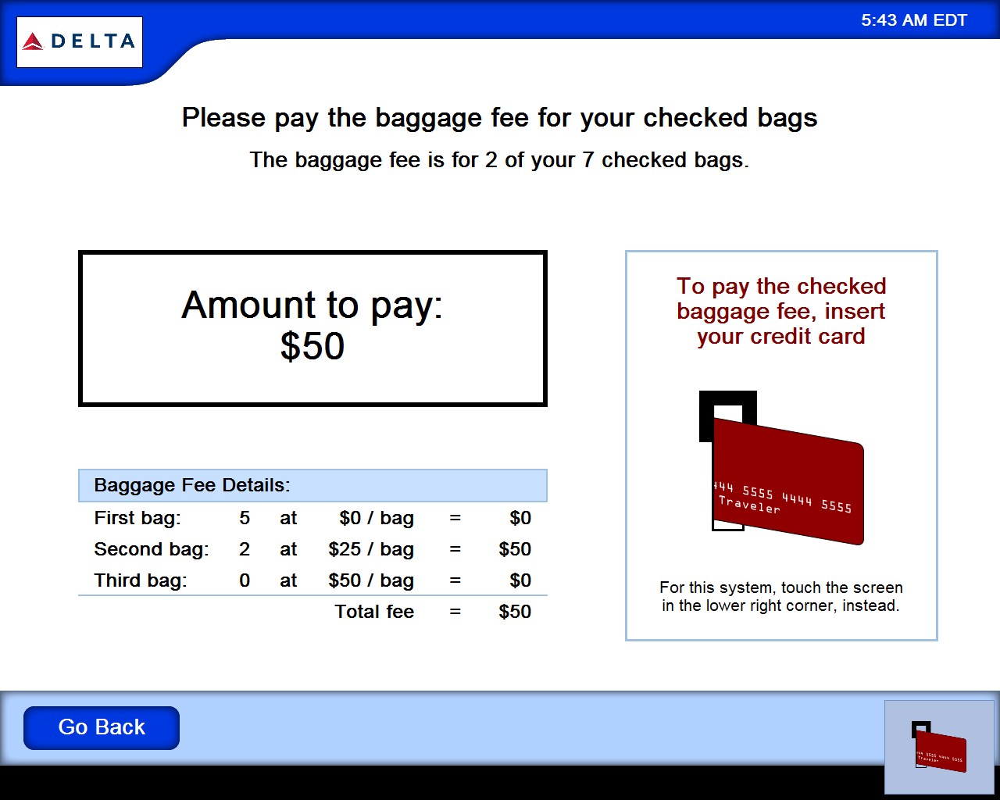

Use this screen to pay the baggage fee for your checked bags.
The screen shows which checked bags have baggage fees, and
how much the baggage fee is for each checked bag.
You can pay the baggage fee with your credit card.
If you would like to change the bags you are checking, then use
the "Go Back" button to return to the previous screen.

___
For more Help, press the EZ Down arrow button.  
To leave Help, press the EZ Help button.

## Bags Page
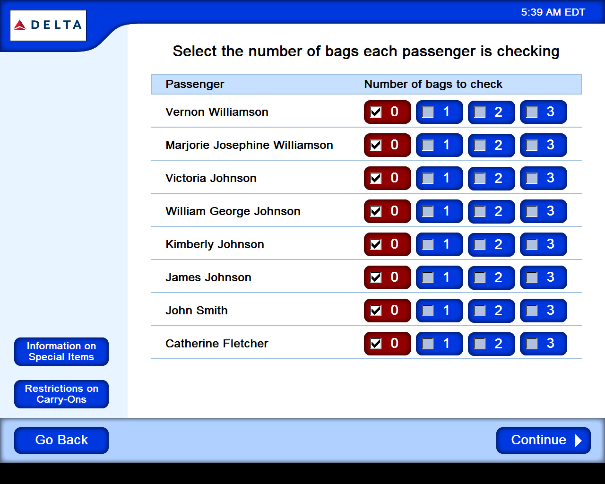

Use this screen to select the number of bags to check for each
passenger.
If you are checking any bags, you also need to indicate if any of
those bags are special items.
There are buttons on this screen that can provide you with
information about special items, and about restrictions on carry-
on baggage.

___
For more Help, press the EZ Down arrow button.  
To leave Help, press the EZ Help button.

## Change Frequent Flyer Number Page

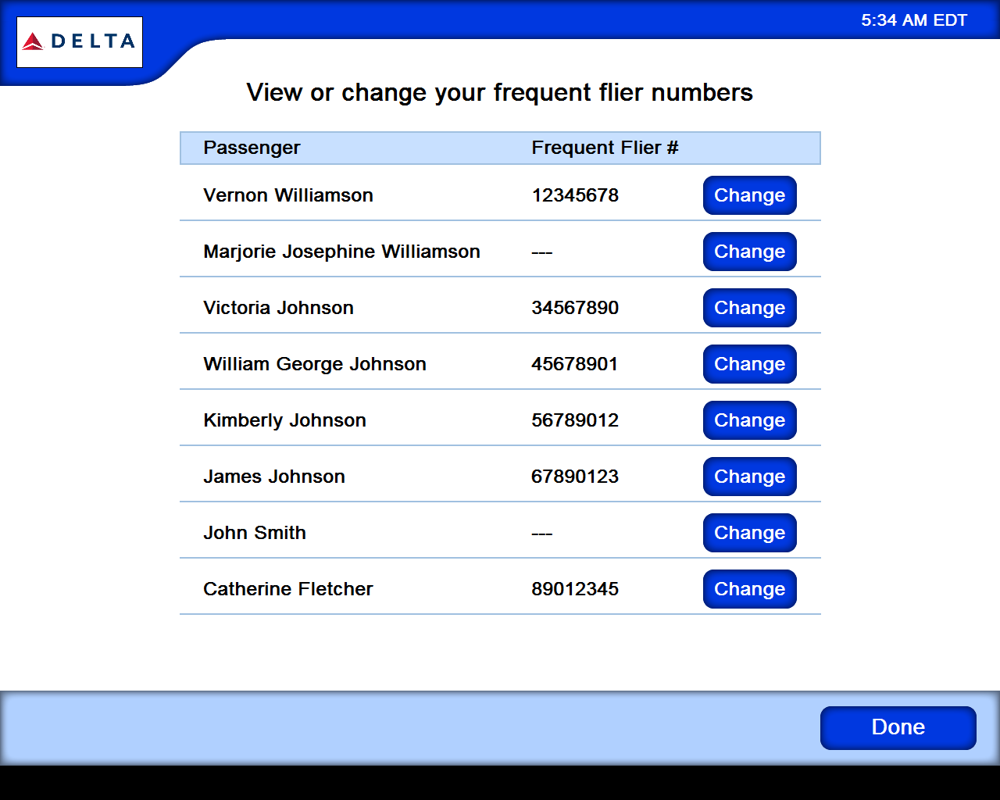

Use this screen to review or change frequent flier numbers.
To change a frequent flier number, use the corresponding
"Change" button. This will take you to another screen where you
can enter the new number.
When you have finished reviewing or updating frequent flier
numbers, use the "Done" button to return to your itinerary.

___
For more Help, press the EZ Down arrow button.  
To leave Help, press the EZ Help button.

## Choose Boarding Pass Page

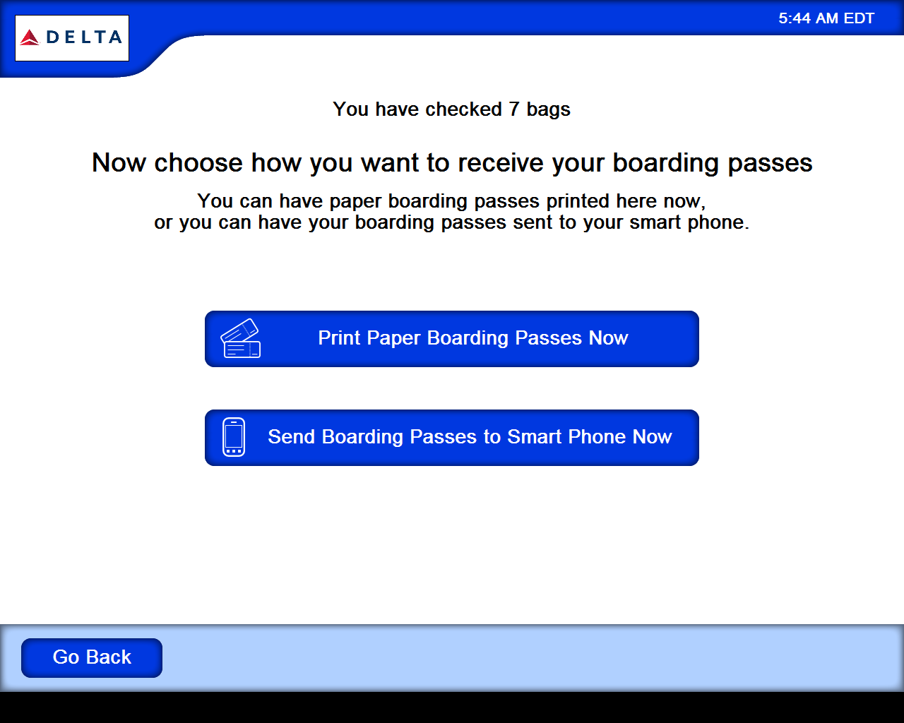

Use this screen to choose how you will receive your boarding
passes.
If you choose to have your boarding passes sent to your smart
phone, the boarding pass information will be sent to the smart
phone number in your frequent flier profile.
If you choose to have your boarding passes printed at the kiosk,
they will be printed immediately.
When you make your choice, you will automatically be taken to
the final check-in screen.

___
For more Help, press the EZ Down arrow button.  
To leave Help, press the EZ Help button.

## Confirmation Number Page

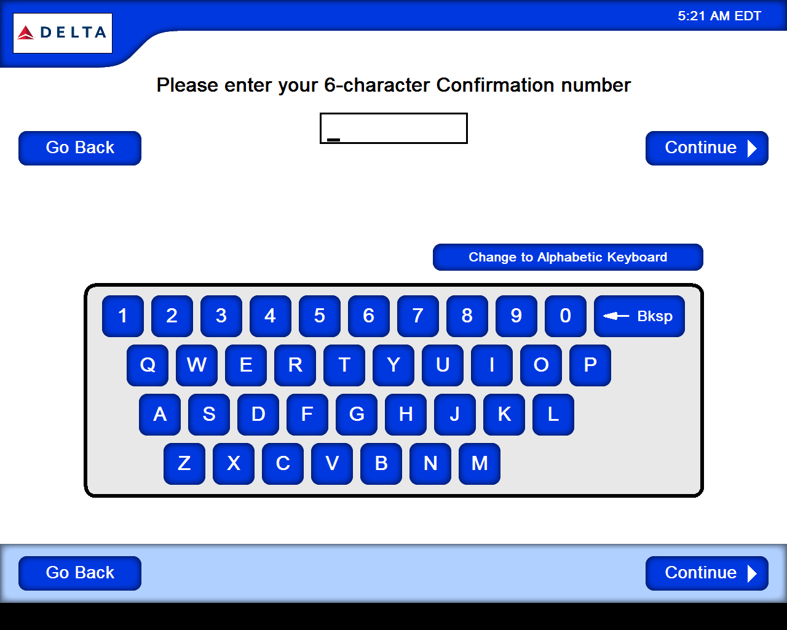

Use this screen to enter your 6-character confirmation number.
Then use the "Next" button to go to your itinerary.
If you do not know the confirmation number for your itinerary,
then use the "Go Back" button, and select another option.

___
For more Help, press the EZ Down arrow button.  
To leave Help, press the EZ Help button.

## Delta Page

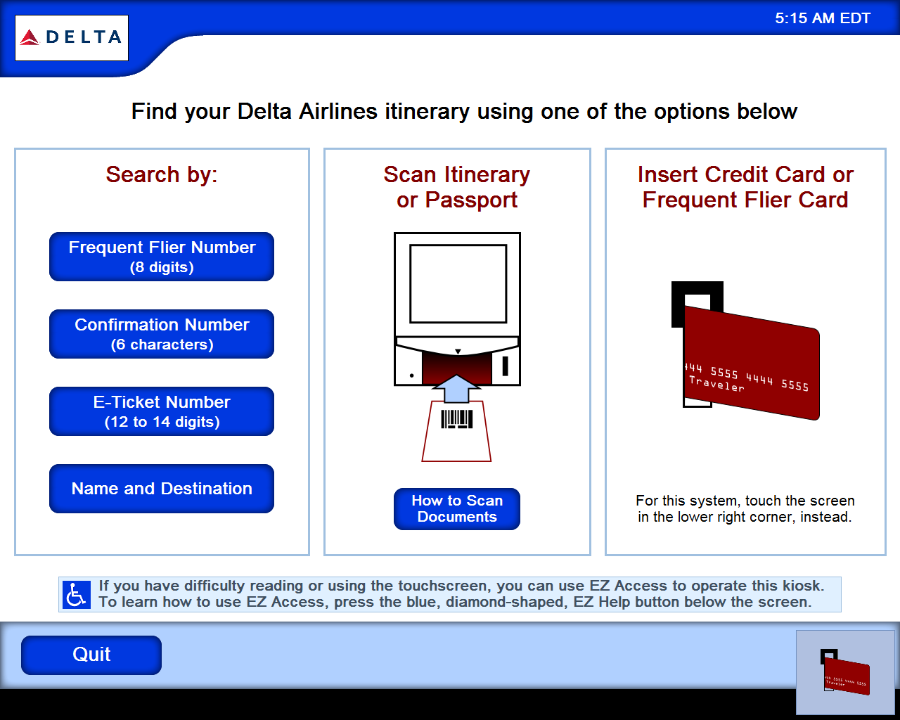

This screen offers several options for finding your itinerary to
begin the check-in process.
You can find your itinerary by inserting a credit card or frequent
flier card, or by scanning your itinerary or passport. Details on
how to do this are supplied on the screen.
If you do not have anything available to swipe or scan, use the
search buttons on the screen to look up your itinerary by
frequent flier number, confirmation number, or e-ticket number,
or by entering your name and destination.

___
For more Help, press the EZ Down arrow button.  
To leave Help, press the EZ Help button.

## E-Ticket Number Page

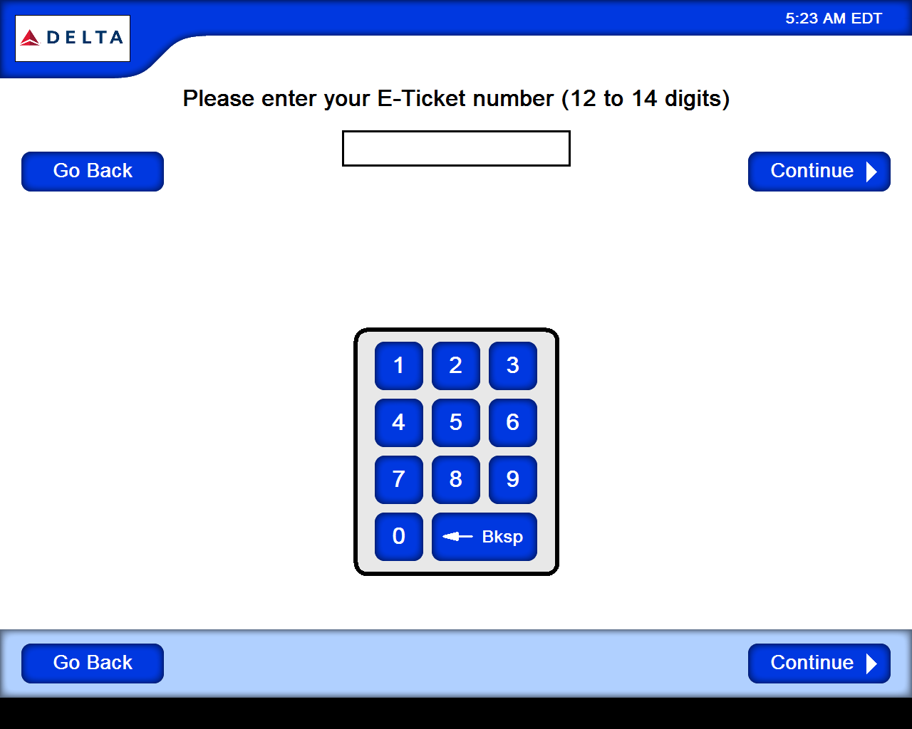

Use this screen to enter your e-ticket number. E-ticket numbers
may have 12, 13, or 14 digits.
When you are done, use the "Next" button to go to your itinerary.
If you do not know the e-ticket number for your itinerary, then
use the "Go Back" button, and select another option.

___
For more Help, press the EZ Down arrow button.  
To leave Help, press the EZ Help button.

## Final Check In Page

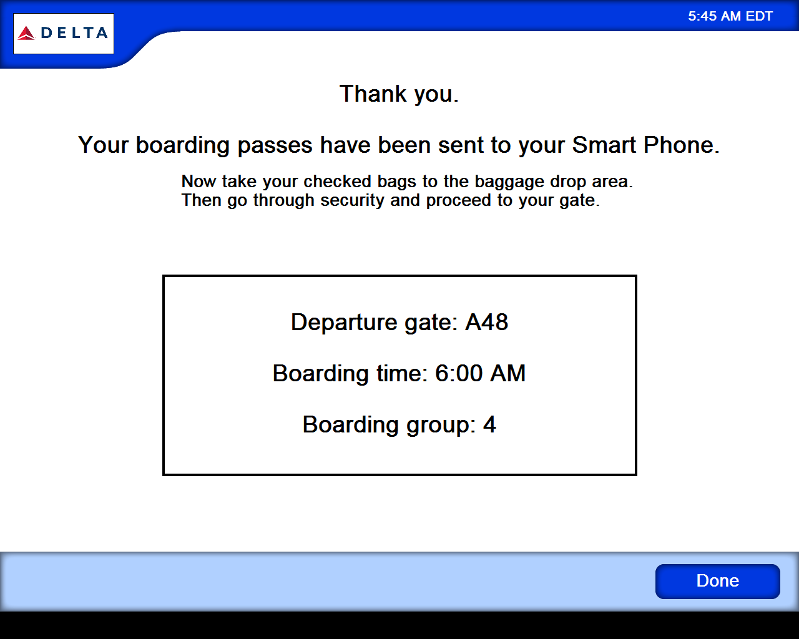

This is the final check-in screen.
It has instructions on what to do next, and a summary of your
boarding information.
When you are done reading the information, you can use the
"Done" button to reset this kiosk.

___
For more Help, press the EZ Down arrow button.  
To leave Help, press the EZ Help button.

## Frequent Flyer Number Page

Use this screen to enter your 8-digit frequent flier number. Then
use the "Next" button to go to your itinerary.
If you do not know your frequent flier number, then use the "Go
Back" button, and select another option.

___
For more Help, press the EZ Down arrow button.  
To leave Help, press the EZ Help button.

## How to Scan Page

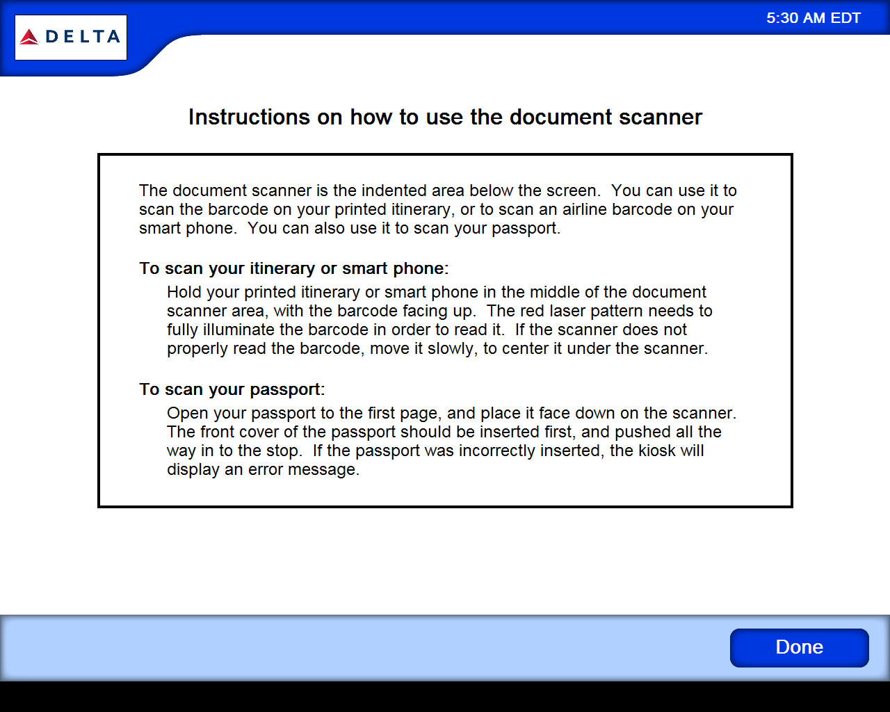

This screen explains how to use the document scanner.
Use the "Done" button to return to the previous screen.

___
For more Help, press the EZ Down arrow button.  
To leave Help, press the EZ Help button.

## Info On Special Items Page

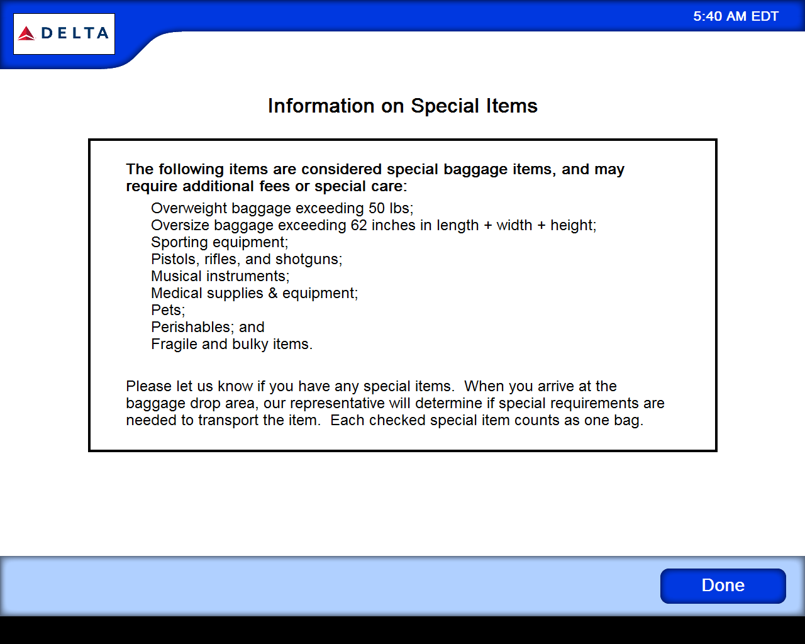

This screen displays information about special items.
Use the "Done" button to return to the previous screen.
___
For more Help, press the EZ Down arrow button.  
To leave Help, press the EZ Help button.

## Itinerary Page

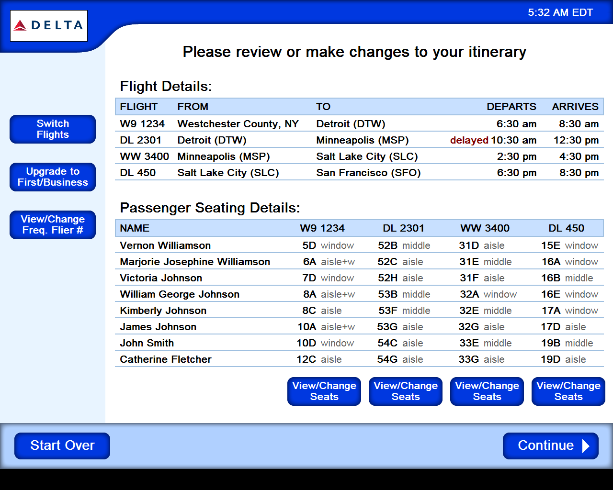

Use this screen to review the details of your itinerary, and to
make any desired changes.
The screen has options to switch flights, to upgrade to first or
business class, to view or change frequent flier numbers, and to
view or change seats on each flight segment.
When you are done making any changes, use the "Next" button
to proceed to the next screen.
If this is not the correct itinerary for your flight today, then use
the "Start Over" button, and try again.

___
For more Help, press the EZ Down arrow button.  
To leave Help, press the EZ Help button.

## Name and Destination Page 1

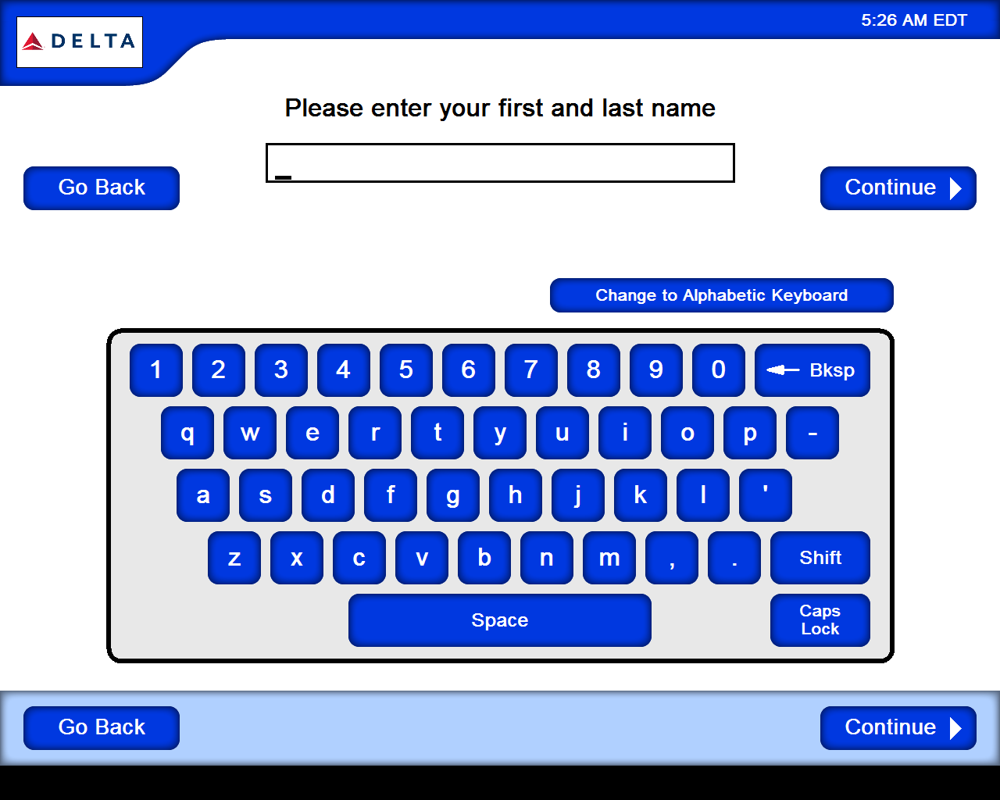

Use this screen to enter your first and last name. Your name
should be typed the way it was when you purchased your ticket.
When you are done, use the "Next" button to go to the next
screen and enter your destination.
If you don't remember how your name was entered when you
purchased your ticket, then use the "Go Back" button, and select
another option.

___
For more Help, press the EZ Down arrow button.  
To leave Help, press the EZ Help button.

## Name and Destination Page 2

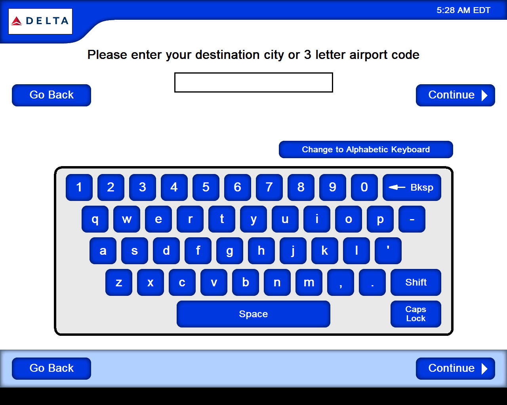

Use this screen to enter your final destination for today's flight.
You can enter the name of your destination city, or the three
letter airport code of your destination airport.
When you are done, use the "Next" button to go to your itinerary.

___
For more Help, press the EZ Down arrow button.  
To leave Help, press the EZ Help button.

## New Frequent Flyer Number Page

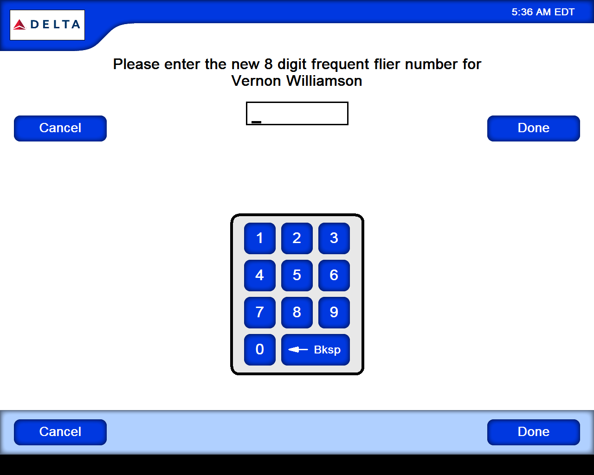

Use this screen to enter the new 8-digit frequent flier number for
the selected passenger. Then use the "Done button to return to
your itinerary.
If you don't want to change the frequent flier number, then use
the "Go Back" button instead.

___
For more Help, press the EZ Down arrow button.  
To leave Help, press the EZ Help button.

## No Confirmation Number Page

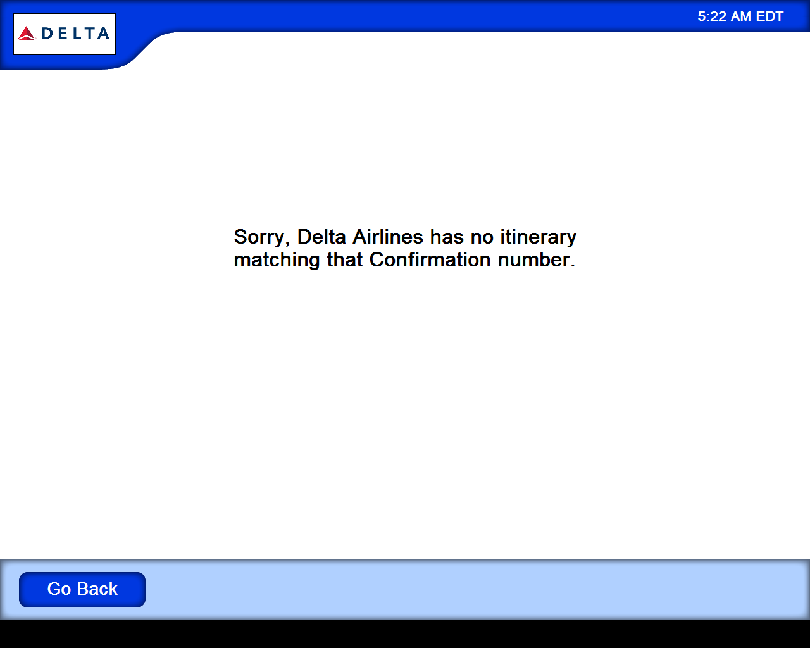

No matching itinerary could be found with Delta Airlines,
for the confirmation number you have entered.
You can try entering your confirmation number again.
You can also try using a different option to look up your itinerary.
Use the "Start Over" button to try again.

___
For more Help, press the EZ Down arrow button.  
To leave Help, press the EZ Help button.

## No E-Ticket Number Page

No matching itinerary could be found with Delta Airlines,
for the e-ticket number you have entered.
You can try entering your e-ticket number again.
You can also try using a different option to look up your itinerary.
Use the "Start Over" button to try again.

___
For more Help, press the EZ Down arrow button.  
To leave Help, press the EZ Help button.

## No Frequent Flyer Number Page

No matching itinerary could be found with Delta Airlines,
for the frequent flier number you have entered.
You can try entering your frequent flier number again.
You can also try using a different option to look up your itinerary.
Use the "Start Over" button to try again.

___
For more Help, press the EZ Down arrow button.  
To leave Help, press the EZ Help button.

## No Name and Destination Page

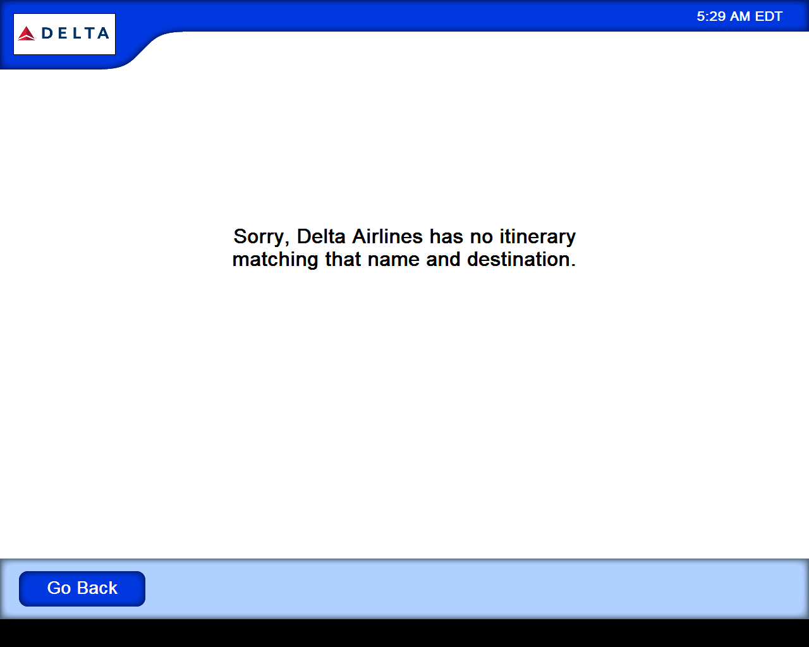

No matching itinerary could be found with Delta Airlines,
for the name and destination you have entered.
You can try entering a different form of your name.
For example: try "Will", or "Bill", instead of "William".
You can also try using a different option to look up your itinerary.
Use the "Start Over" button to try again.

___
For more Help, press the EZ Down arrow button.  
To leave Help, press the EZ Help button.

## Restrictions on Carry 

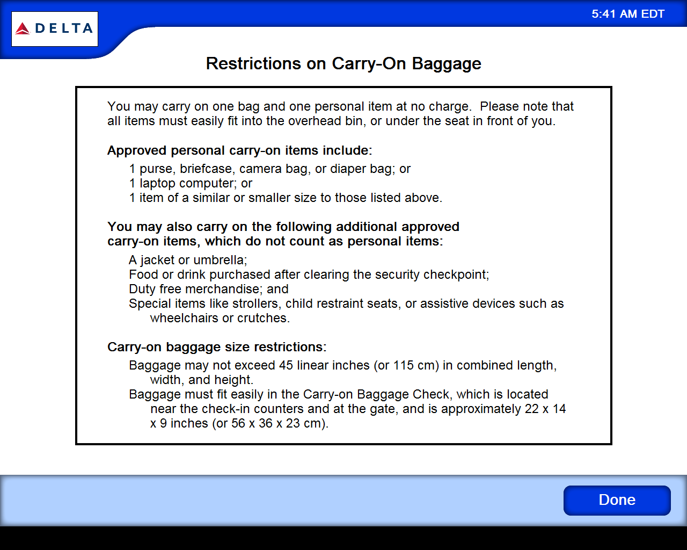

This screen displays information about carry-on baggage.
Use the "Done" button to return to the previous screen.

___
For more Help, press the EZ Down arrow button.  
To leave Help, press the EZ Help button.

## View or Change Seats Page

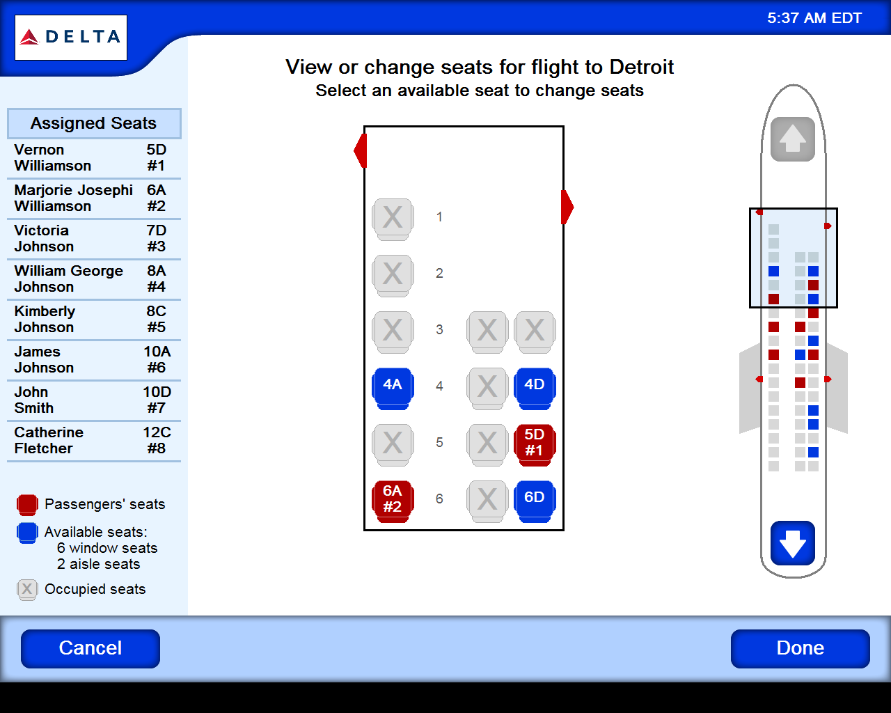

### Page 1
Use this screen to view or change your seating for this flight segment.
The screen has a list of your current seating assignments, an
overview of the seating available in the entire plane, and a close-
up of a section of several rows on the plane.
To find or view different seats, use the Up and Down arrow
buttons to move to the desired section of the plane. Then
browse the individual seats in the close-up section.
(Continued ... )

___
For more Help, press the EZ Down arrow button.  
To leave Help, press the EZ Help button.

### Page 2

(Continuing ... )
To change to a new seat, or to exchange seats with another
passenger, select an available seat, and then choose the
passenger to sit in that seat.
If you want to keep any seat changes you have made for this
flight segment, use the "Done" button to return to your itinerary.
Otherwise, use the "Go Back" button instead.

___
For more Help, press the EZ Down arrow button.  
To leave Help, press the EZ Help button.