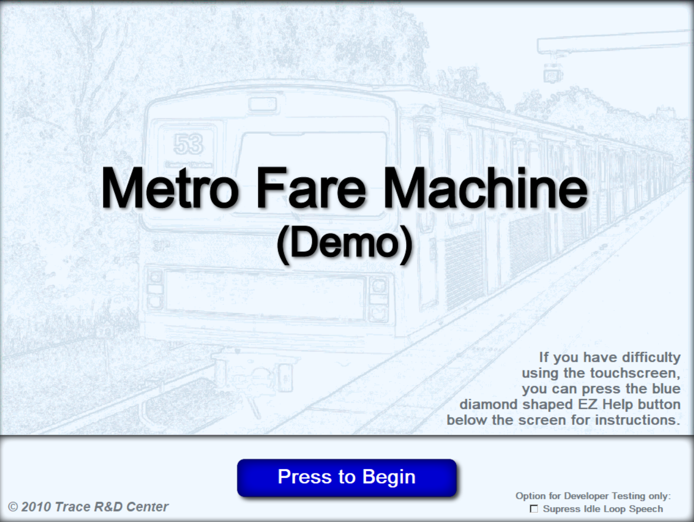
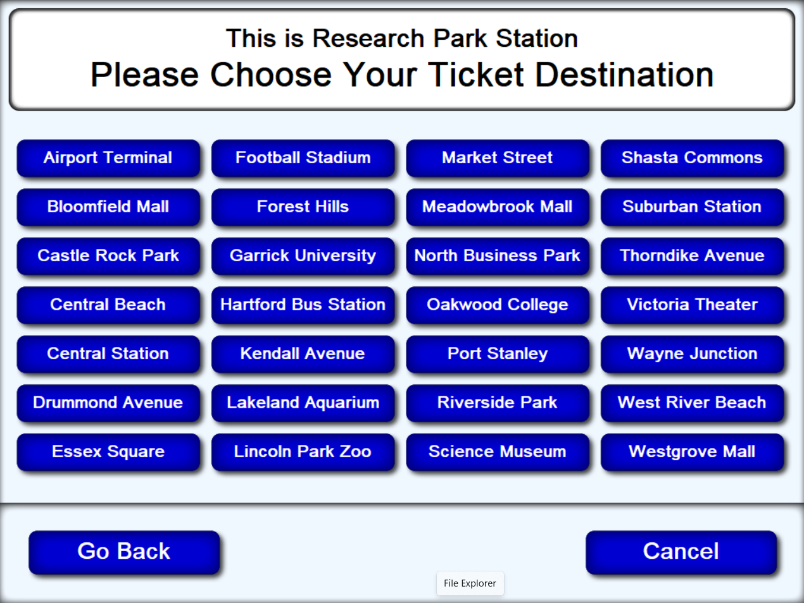
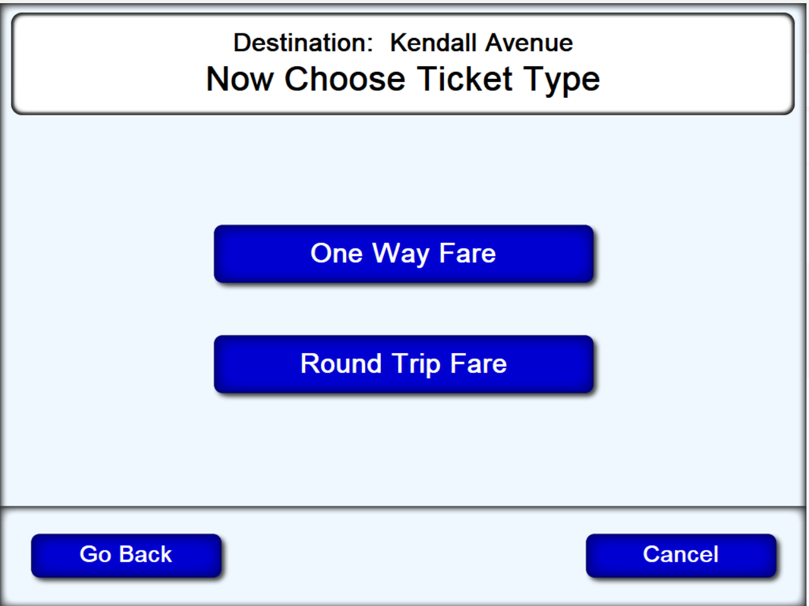
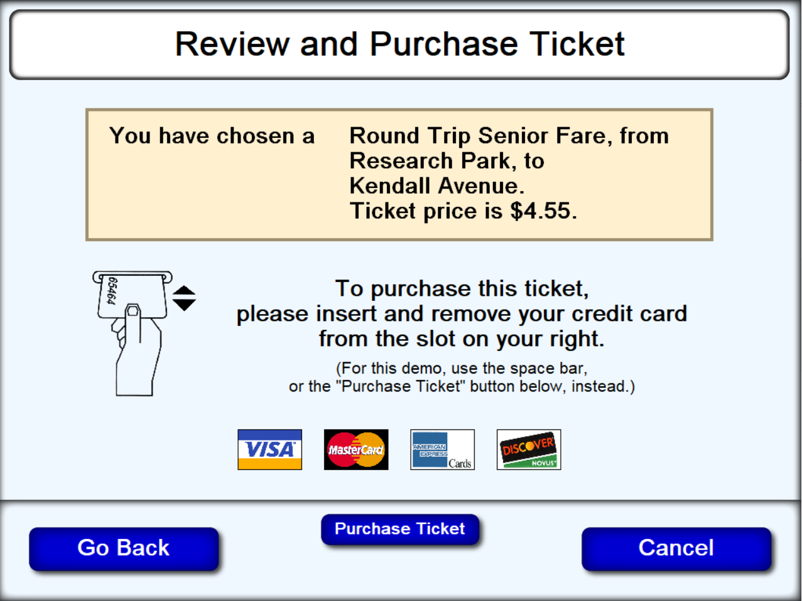
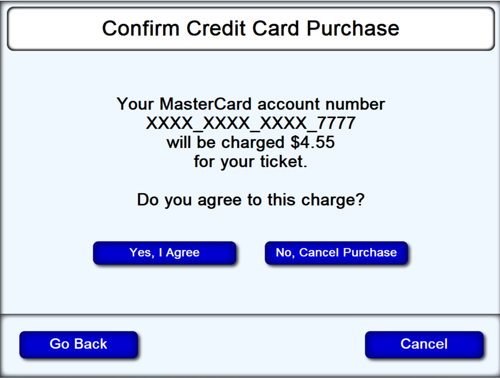

# Text From EZ Access Help Screens
## Splash Screen

### Page 1
#### How to Use EZ Access

Below the blue diamond shaped EZ Help button are two arrow shaped buttons and a round button. These four buttons can be used to operate this terminal instead of the touchscreen. 

The EZ Up and Down arrow buttons are used to move through the instructions and button names shown on each screen. The round EZ action button is used to re-read an instruction item, or to carry out the function of a button shown on the touchscreen. 
___
To repeat this message, press the round EZ Action button  
___
For more Help, press the EZ Down arrow.  
To leave Help, press the EZ Help button. 

### Page 2
This is the idle screen for the Metro Fare Machine Demo
Use the “Press to Begin” button at the bottom of this screen to start your ticket purchase.

___
To leave Help, press the EZ Help button.

### Page 3
End of Help Text  
To leave Help, press the EZ Help button. 

## Destination Screen

### Page 1
You are currently located at Research Park Station
Use this screen to choose your ticket destination from the alphabetical list of available choices 
Choices for the types of ticket will be presented on the following screens

For more Help, press the EZ Down arrow.  
To leave Help, press the EZ Help button  

### Page 2
#### How to Use EZ Help
You can press the diamond shaped EZ Help button for help at any time while using this terminal. Then use the EZ Up and Down arrow button to move through the help instructions, and use the round EZ Action button to repeat a help instruction item. 

When you are in EZ Help, you can also press any key on the keyboard to have it identified for you.

You can also press the EZ Help button twice to stop the speech whenever you are not already in EZ Help.
___
For more Help, press the EZ Down arrow.  
To leave Help, press the EZ Help button

### Page 3
#### How to Use Button Help
When Button Help is turned on, the buttons do nothing except say their name and function. This lets you safely explore the buttons on the keyboard and screen to learn about them. 

Button Help will be turned on whenever the diamond shaped EZ Help button is being held down.

Button Help can also be locked on by holding the EZ Help button down for five seconds. 
___
For more Help, press the EZ Down arrow.  
To leave Help, press the EZ Help button

### Page 4
#### How to Use EZ Access

Below the blue diamond shaped EZ Help button are two arrow shaped buttons and a round button. These four buttons can be used to operate this terminal instead of the touchscreen. 

The EZ Up and Down arrow buttons are used to move through the instructions and button names shown on each screen. The round EZ action button is used to re-read an instruction item, or to carry out the function of a button shown on the touchscreen. 
___
To leave Help, press the EZ Help button. 

### Page 5
End of Help Text  
To leave Help, press the EZ Help button. 

## Ticket Type Screen

### Page 1
Use this screen to choose the type of ticket you would like to purchase. 

You can buy a one way ticket or a round trip ticket.
___
For more Help, press the EZ Down arrow.  
To leave Help, press the EZ Help button

### Page 2
#### How to Use EZ Help
You can press the diamond shaped EZ Help button for help at any time while using this terminal. Then use the EZ Up and Down arrow button to move through the help instructions, and use the round EZ Action button to repeat a help instruction item. 

When you are in EZ Help, you can also press any key on the keyboard to have it identified for you.

You can also press the EZ Help button twice to stop the speech whenever you are not already in EZ Help.
___
For more Help, press the EZ Down arrow.  
To leave Help, press the EZ Help button

### Page 3
#### How to Use Button Help
When Button Help is turned on, the buttons do nothing except say their name and function. This lets you safely explore the buttons on the keyboard and screen to learn about them. 

Button Help will be turned on whenever the diamond shaped EX Help button is being held down.

Button Help can also be locked on by holding the EZ Help button down for five seconds. 
___
For more Help, press the EZ Down arrow.  
To leave Help, press the EZ Help button

### Page 4
#### How to Use EZ Access

Below the blue diamond shaped EZ Help button are two arrow shaped buttons and a round button. These four buttons can be used to operate this terminal instead of the touchscreen. 

The EZ Up and Down arrow buttons are used to move through the instructions and button names shown on each screen. The round EZ action button is used to re-read an instruction item, or to carry out the function of a button shown on the touchscreen. 
___
To leave Help, press the EZ Help button. 

### Page 5
End of Help Text 
To leave Help, press the EZ Help button.

## Fare Class Screen

### Page 1
Use this screen to choose the correct fare class for the ticket you would like to purchase.

You can buy a regular adult fare ticket or a child’s fare ticket for children under 16 years old or a senior fare ticket for adults at least 65 years old.
___
For more Help, press the EZ Down arrow.  
To leave Help, press the EZ Help button

### Page 2
#### How to Use EZ Help
You can press the diamond shaped EZ Help button for help at any time while using this terminal. Then use the EZ Up and Down arrow button to move through the help instructions, and use the round EZ Action button to repeat a help instruction item. 

When you are in EZ Help, you can also press any key on the keyboard to have it identified for you.

You can also press the EZ Help button twice to stop the speech whenever you are not already in EZ Help.
___
For more Help, press the EZ Down arrow.  
To leave Help, press the EZ Help button

### Page 3
#### How to Use Button Help
When Button Help is turned on, the buttons do nothing except say their name and function. This lets you safely explore the buttons on the keyboard and screen to learn about them. 

Button Help will be turned on whenever the diamond shaped EX Help button is being held down.

Button Help can also be locked on by holding the EZ Help button down for five seconds. 
___
For more Help, press the EZ Down arrow.  
To leave Help, press the EZ Help button

### Page 4
#### How to Use EZ Access

Below the blue diamond shaped EZ Help button are two arrow shaped buttons and a round button. These four buttons can be used to operate this terminal instead of the touchscreen. 

The EZ Up and Down arrow buttons are used to move through the instructions and button names shown on each screen. The round EZ action button is used to re-read an instruction item, or to carry out the function of a button shown on the touchscreen. 
___
To leave Help, press the EZ Help button. 

### Page 5
End of Help Text  
To leave Help, press the EZ Help button.

## Purchase Screen

### Page 1
Use this screen to review and purchase your ticket.

Check out the details of the ticket you have selected. 

Then follow the on-screen instructions for purchasing your ticket with your credit card.
___
For more Help, press the EZ Down arrow.  
To leave Help, press the EZ Help button 

### Page 2
#### How to Use EZ Help
You can press the diamond shaped EZ Help button for help at any time while using this terminal. Then use the EZ Up and Down arrow button to move through the help instructions, and use the round EZ Action button to repeat a help instruction item. 

When you are in EZ Help, you can also press any key on the keyboard to have it identified for you.

You can also press the EZ Help button twice to stop the speech whenever you are not already in EZ Help.
___
For more Help, press the EZ Down arrow.  
To leave Help, press the EZ Help button

### Page 3
#### How to Use Button Help
When Button Help is turned on, the buttons do nothing except say their name and function. This lets you safely explore the buttons on the keyboard and screen to learn about them. 

Button Help will be turned on whenever the diamond shaped EX Help button is being held down.

Button Help can also be locked on by holding the EZ Help button down for five seconds. 
___
For more Help, press the EZ Down arrow.  
To leave Help, press the EZ Help button

### Page 4
#### How to Use EZ Access

Below the blue diamond shaped EZ Help button are two arrow shaped buttons and a round button. These four buttons can be used to operate this terminal instead of the touchscreen. 

The EZ Up and Down arrow buttons are used to move through the instructions and button names shown on each screen. The round EZ action button is used to re-read an instruction item, or to carry out the function of a button shown on the touchscreen. 
___
To leave Help, press the EZ Help button. 

### Page 5
End of Help Text  
To leave Help, press the EZ Help button.

## Credit Card Purchase Confirmation Screen

### Page 1
Use this screen to confirm that you want to charge the cost of your ticket to the credit card you used. 
___
For more Help, press the EZ Down arrow.  
To leave Help, press the EZ Help button

### Page 2
#### How to Use EZ Help
You can press the diamond shaped EZ Help button for help at any time while using this terminal. Then use the EZ Up and Down arrow button to move through the help instructions, and use the round EZ Action button to repeat a help instruction item. 

When you are in EZ Help, you can also press any key on the keyboard to have it identified for you.

You can also press the EZ Help button twice to stop the speech whenever you are not already in EZ Help.
___
For more Help, press the EZ Down arrow.  
To leave Help, press the EZ Help button

### Page 3
#### How to Use Button Help
When Button Help is turned on, the buttons do nothing except say their name and function. This lets you safely explore the buttons on the keyboard and screen to learn about them. 

Button Help will be turned on whenever the diamond shaped EX Help button is being held down.

Button Help can also be locked on by holding the EZ Help button down for five seconds. 
___
For more Help, press the EZ Down arrow.  
To leave Help, press the EZ Help button

### Page 4
#### How to Use EZ Access

Below the blue diamond shaped EZ Help button are two arrow shaped buttons and a round button. These four buttons can be used to operate this terminal instead of the touchscreen. 

The EZ Up and Down arrow buttons are used to move through the instructions and button names shown on each screen. The round EZ action button is used to re-read an instruction item, or to carry out the function of a button shown on the touchscreen. 
___
To leave Help, press the EZ Help button. 

### Page 5
End of Help Text  
To leave Help, press the EZ Help button.
